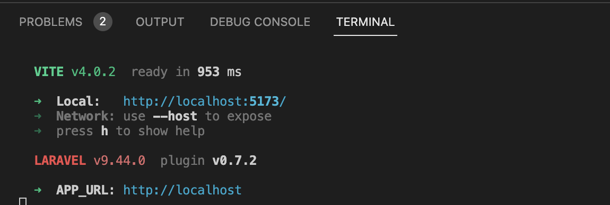
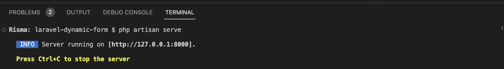
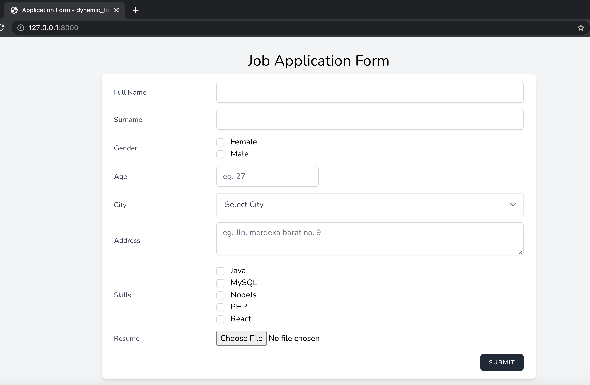

# Laravel Dynamic Form

## Tech Stacks

1. Laravel 9.1
2. React ^18.2.0
3. MySQL

## Installation

Clone the repo locally:

```
git clone https://github.com/rismawtsa/laravel-dynamic-form

cd laravel-dynamic-form
```
## Front End
Install NPM dependencies:

```
npm install
```

Running the frontend

```
npm run dev
```

The output on your terminal will look like this


## Back End

Create `.env` file from the `.env.example` on the root of this project, and change the value of DB config based on the local environment

```
DB_CONNECTION=
DB_HOST=
DB_PORT=
DB_DATABASE=
DB_USERNAME=
DB_PASSWORD=
```

Open the new  terminal,

Install PHP dependencies:

```
composer install
```

Run database migrations:

```
php artisan migrate
```

Run database seeder:

```
php artisan db:seed
```

Run the server:
```
Run artisan server
```

The output on your terminal will look like this


Open the browser and enter `http://127.0.0.1:8000`

